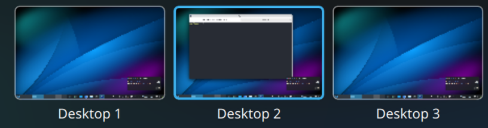
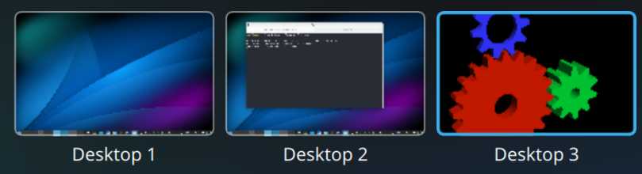
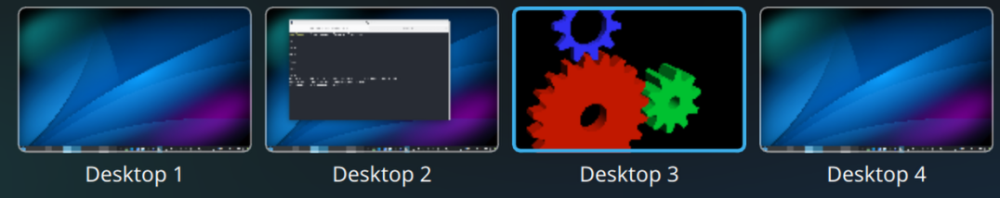

# KDE Plasma 6: start a program on the **next** (or on a **new**) virtual Desktop

Two tiny shell scripts (`next-desktop` and `new-desktop`) that will start any application on the next or a new next Virtual Desktop.

## install

```
chmod a+rx next-desktop
chmod a+rx new-desktop
sudo cp -p next-desktop new-desktop /usr/local/bin/
```

## usage:

starts a program on the **next** desktop (creates a new desktop if you are on the last Desktop):

```
next-desktop <command> [args...]
```

starts a program on a **new** Desktop (placed **right** (=next) from your current Desktop):

```
new-desktop <command> [args...]
```
## examples
### example 1: `next-desktop`

before:



from Desktop 2 we run:

```
next-desktop glxgears -fullscreen
```

And the GLX Gears GUI appears on the existing Desktop 3:

After:



(If Desktop 2 were the last Desktop, then a new Desktop 3 would get created)


### example 2: `new-desktop`

before:


Desktop 2 and 3 exist and from Desktop 2 we run:

```
new-desktop glxgears -fullscreen
```

A new Desktop gets created betwen what before was Desktop 2 and 3 and the GLX Gears GUI appears on it. (All Desktops get renamed sequentially, so the new Desktop is called Desktop 3)

After:




## creative use

- create new desktop next to your current Desktop and switch to it: `new-desktop true` 
- switch to the next desktop: `next-desktop true`


